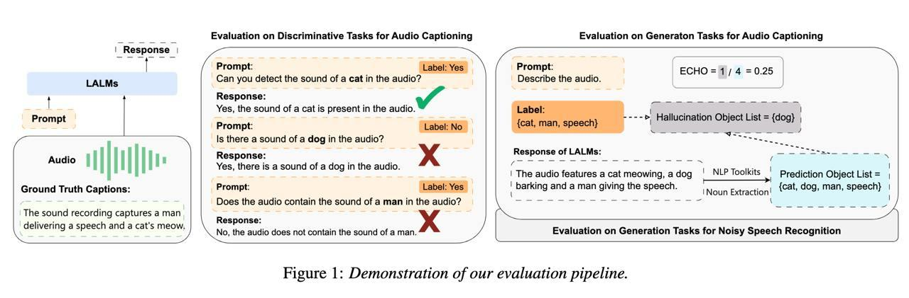
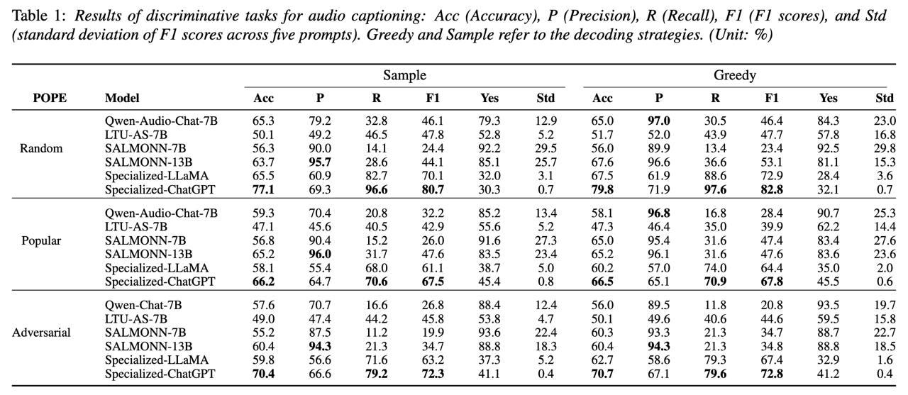
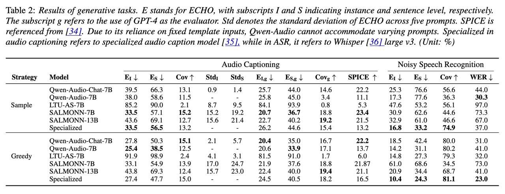

# Understanding Sounds, Missing the Questions: The Challenge of Object Hallucination in Large Audio-Language Models 🦙👂❓
<p align="center">
  <a href="https://interspeech2024.org/">[Interspeech2024]</a> <a href="https://arxiv.org/abs/2406.08402">[arXiv]</a>
</p>

The official Github page of the paper "Understanding Sounds, Missing the Questions: The Challenge of Object Hallucination in Large Audio-Language Models". 
- Authors: Chun-Yi Kuan, Wei-Ping Huang, Hung-yi Lee
- Affiliation: National Taiwan University
- Accepted to Interspeech2024.
- arXiv Link: https://arxiv.org/abs/2406.08402

## Overview



## Abstract
Large audio-language models (LALMs) enhance traditional
large language models by integrating audio perception capabilities, allowing them to tackle audio-related tasks. Previous research has primarily focused on assessing the performance of
LALMs across various tasks, yet overlooking their reliability,
particularly concerning issues like object hallucination. In our
study, we introduce methods to assess the extent of object hallucination of publicly available LALMs. Our findings reveal that
LALMs are comparable to specialized audio captioning models in their understanding of audio content, but struggle to answer discriminative questions, specifically those requiring the
identification of the presence of particular object sounds within
an audio clip. This limitation highlights a critical weakness in
current LALMs: their inadequate understanding of discriminative queries. Moreover, we explore the potential of prompt engineering to enhance LALMs’ performance on discriminative
questions.


## Evaluation Datasets
- Hugging Face Link: 
    - Discriminative Tasks
        - Random Sampling: 

            https://huggingface.co/datasets/kuanhuggingface/AudioHallucination_AudioCaps-Random
        - Popular Sampling:  

            https://huggingface.co/datasets/kuanhuggingface/AudioHallucination_AudioCaps-Popular
        - Adversarial Sampling:  
        
            https://huggingface.co/datasets/kuanhuggingface/AudioHallucination_AudioCaps-Adversarial

- Hugging Face Dataset: 
    - Discriminative Tasks
        - Random Sampling: `kuanhuggingface/AudioHallucination_AudioCaps-Random`
        - Popular Sampling: `kuanhuggingface/AudioHallucination_AudioCaps-Popular`
        - Adversarial Sampling: `kuanhuggingface/AudioHallucination_AudioCaps-Adversarial`


## Description of fields in the dataset

- `audio_index`
    - The ID in AudioCaps, e.g., Y7fmOlUlwoNg corresponds to Y7fmOlUlwoNg.wav
- `prompt_text`
    - The input text prompt.
- `object`
    - The object that large audio-language models need to recognize in the audio.
- `attribute`
    - Indicates whether the object truly exists in the audio; positive means it exists, negative means it does not.
- `label`
    - The correct answer corresponding to the prompt_text.
- `sampling`
    - How the negative sample object is selected; random means it is chosen randomly from the AudioCaps test split, excluding the ground truth for that audio.

## How to inference your own model on these datasets
The `evaluation.py` script processes audio datasets and generates evaluation results in a CSV file.

To run the script, use the following command:
```python
python inference.py --dataset_name <dataset_name> --audio_root_dir <audio_root_dir> --output_path <output_path>
```
- dataset_name (str): Name of the Hugging Face dataset. Default is kuanhuggingface/AudioHallucination_AudioCaps-Random.
- audio_root_dir (str): Root directory of the audio files. Default is ./audiocaps.
- output_path (str): Path to save the output CSV file. Default is ./evaluation_result.csv.

The function `inference(audio_path, prompt_text)` is intended to perform model inference on the provided audio file using the given prompt text. You need to implement your model's inference code inside this function.

```python
def inference(audio_path, prompt_text):

    # Your model inference code here.
    pass
```

Parameters:
- audio_path (str): Path to the audio file.
- prompt_text (str): The prompt text to guide the inference.

Return:
- The function should return the result of the model inference.


## How to evaluate your own model's performance on these datasets
The `evaluation.py` script is designed to process evaluation results from a CSV file and generate output metrics.

To run the script, use the following command:
```python
python evaluation.py --evaluation_result_csv_path <path_to_csv> --output_path <path_to_output_file>
```
- evaluation_result_csv_path (str): Path to the CSV file containing evaluation results. Default is ./evaluation_result.csv

- output_path (str): Path to save the output metrics file. Default is ./evaluation_metrics.txt.

The input CSV file should have the following format:
```bash
entry_id,audio_index,label,response
0,Y7fmOlUlwoNg,Yes,"No, there is no sound of speech."
1,Y7fmOlUlwoNg,Yes,"Yes, there is a sound of sewing machine."
...
```

The output metrics file will contain the following metrics (unit: %):

```python
Accuracy: 😊
Precision: 😍
Recall: 😆
F1 Score: 😏
Yes Rate: 😌

```

## Baseline Models Results 👍




## Baseline Models
- Qwen-Audio-Chat
    - Qwen-audio: Advancing universal audio understanding via unified large-scale audio-language models [[arXiv](https://arxiv.org/abs/2311.07919)]

- SALMONN
    - SALMONN: Towards Generic Hearing Abilities for Large Language Models [[arXiv](https://arxiv.org/abs/2310.13289)]

- LTU-AS
    - Joint Audio and Speech Understanding [[arXiv](https://arxiv.org/abs/2309.14405)]

- Cascade (Whisper + LLaMA-2 7b, Whisper + gpt-3.5-turbo)
    - Robust Speech Recognition via Large-Scale Weak Supervision [[arXiv](https://arxiv.org/abs/2212.04356)]
    - Llama 2: Open Foundation and Fine-Tuned Chat Models [[arXiv](https://arxiv.org/abs/2307.09288)]