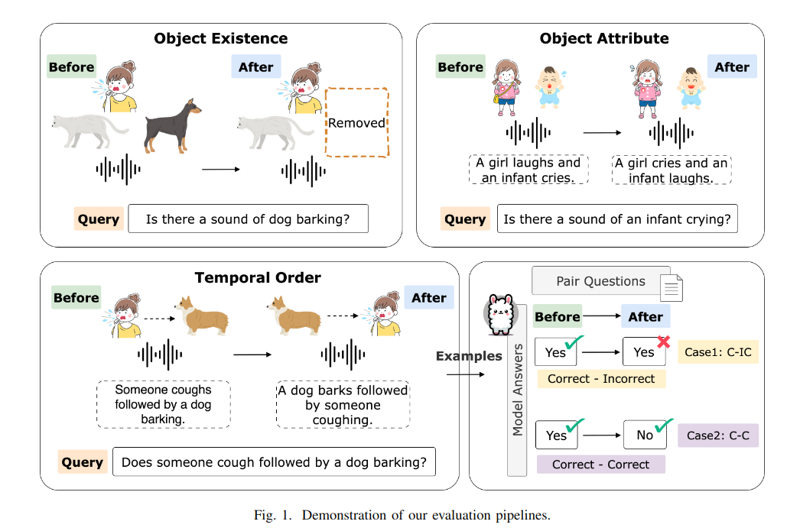

# Can Large Audio-Language Models Truly Hear? Tackling Hallucinations with Multi-Task Assessment and Stepwise Audio Reasoning 🦙👂❓
<p align="center">
  <a href="https://2025.ieeeicassp.org/">[ICASSP2025]</a> <a href="https://arxiv.org/abs/2410.16130">[arXiv]</a>
</p>

The official Github page of the paper "Can Large Audio-Language Models Truly Hear? Tackling Hallucinations with Multi-Task Assessment and Stepwise Audio Reasoning". 
- Authors: Chun-Yi Kuan, Hung-yi Lee
- Affiliation: National Taiwan University
- Accepted to [ICASSP2025](https://2025.ieeeicassp.org/).
- arXiv Link: https://arxiv.org/abs/2410.16130

## Overview



## Key Findings and Insights

### Core Focus
- Exploring hallucination issues in large audio-language models (LALMs) that hinder their real-world reliability.

### Challenges Addressed
- (1) Hallucinating non-existent sound events
- (2) Misidentifying the order of sound events
- (3) Incorrectly attributing sound sources

### Proposed Tasks

- (1) Object Existence: Does the sound event exist?
- (2) Temporal Order: Are sound events in the correct sequence?
- (3) Object Attribute: Are sound sources attributed correctly?

### Key Insights
- Experimental results reveal LALMs struggle with fundamental audio understanding tasks.

### Methodology
- A multi-turn chain-of-thought approach significantly enhances task performance, addressing limitations in LALMs.

### Impact
- Highlights the need for improved models to enhance audio understanding and reasoning.

## Evaluation Datasets
- Hugging Face Link: 
    - Object Existence | [Hugging Face](https://huggingface.co/datasets/kuanhuggingface/Audio-Hallucination_Object-Existence_AudioCaps-ESC50-VocalSound)
    - Temporal Order | [Hugging Face](https://huggingface.co/datasets/kuanhuggingface/Audio-Hallucination_Temporal-Order_CompA-Order)
    - Object Attribute | [Hugging Face](https://huggingface.co/datasets/kuanhuggingface/Audio-Hallucination_Object-Attribute_CompA-Attribute)

- Hugging Face Dataset: 
    - Object Existence: `kuanhuggingface/Audio-Hallucination_Object-Existence_AudioCaps-ESC50-VocalSound`
    - Temporal Order: `kuanhuggingface/Audio-Hallucination_Temporal-Order_CompA-Order`
    - Object Attribute: `kuanhuggingface/Audio-Hallucination_Object-Attribute_CompA-Attribute`

- Original Dataset:
    - For `Object Existence`, we combine audio data from `AudioCaps`, `ESC50`, and `VocalSound`. The dataset will be released soon.
    - For `Temporal Order`, we use audio data from [CompA-Order](https://sreyan88.github.io/compa_iclr/), as described in the paper "CompA: Addressing the Gap in Compositional Reasoning in Audio-Language Models" ([Link](https://openreview.net/forum?id=86NGO8qeWs))
    - For `Object Attribute`, we use audio data from [CompA-Attribute](https://sreyan88.github.io/compa_iclr/), as described in the paper "CompA: Addressing the Gap in Compositional Reasoning in Audio-Language Models" ([Link](https://openreview.net/forum?id=86NGO8qeWs))

- We acknowledge and appreciate the efforts of the authors of the original datasets, including AudioCaps, ESC50, VocalSound, and CompA, for making their resources publicly available. Their work has been invaluable to our research.
    - AudioCaps: Generating Captions for Audios in The Wild ([Link](https://aclanthology.org/N19-1011/))
    - ESC-50: Dataset for Environmental Sound Classification ([Link](https://github.com/karolpiczak/ESC-50))
    - Vocalsound: A Dataset for Improving Human Vocal Sounds Recognition ([Link](https://arxiv.org/abs/2205.03433))
    - CompA: Addressing the Gap in Compositional Reasoning in Audio-Language Models ([Link](https://openreview.net/forum?id=86NGO8qeWs))


## Description of fields in the dataset

- `audio`
    - Refers to the original audio ID in the dataset. For example, `CompA_order_files/1.wav` corresponds to `1.wav` in the `CompA Order dataset`.
- `query`
    - The input text prompt.
- `object`
    - The object that large audio-language models need to recognize in the audio.
- `attribute`
    - Indicates whether the object truly exists in the audio: positive means it exists, negative means it does not. (The same applies to temporal order.)
- `ground_truth`
    - The correct answer corresponding to the prompt_text.

## How to inference your own model on these datasets
The `evaluation.py` script processes audio datasets and generates evaluation results in a CSV file.

To run the script, use the following command:
```python
python inference.py --dataset_name <dataset_name> --audio_root_dir <audio_root_dir> --output_path <output_path>
```
- dataset_name (str): Name of the Hugging Face dataset. Default is `kuanhuggingface/Audio-Hallucination_Temporal-Order_CompA-Order`.
- audio_root_dir (str): Root directory of the audio files. Default is `./`.
- output_path (str): Path to save the output CSV file. Default is `./evaluation_result.csv`.

The function `inference(audio_path, prompt_text)` is intended to perform model inference on the provided audio file using the given prompt text. You need to implement your model's inference code inside this function.

```python
def inference(audio_path, prompt_text):

    # Your model inference code here.
    pass
```

Parameters:
- audio_path (str): Path to the audio file.
- prompt_text (str): The prompt text to guide the inference.

Return:
- The function should return the result of the model inference.


## How to evaluate your own model's performance on these datasets
The `evaluation.py` script is designed to process evaluation results from a CSV file and generate output metrics.

To run the script, use the following command:
```python
python evaluation.py --evaluation_result_csv_path <path_to_csv> --output_path <path_to_output_file>
```
- evaluation_result_csv_path (str): Path to the CSV file containing evaluation results. Default is ./evaluation_result.csv

- output_path (str): Path to save the output metrics file. Default is ./evaluation_metrics.txt.

The input CSV file should have the following format:
```bash
entry_id,audio_index,label,response
0,Y7fmOlUlwoNg,Yes,"No, there is no sound of speech."
1,Y7fmOlUlwoNg,Yes,"Yes, there is a sound of sewing machine."
...
```

The output metrics file will contain the following metrics (unit: %):

```python
Accuracy: 😊
Precision: 😍
Recall: 😆
F1 Score: 😏
Yes Rate: 😌
Instruction Following Rate: 👉 
Correct-Correct Ratio: 😎
Incorrect Incorrect Ratio: 😑
Correct Incorrect Ratio: 😅
Incorrect Correct Ratio: 😮
```

## Baseline Models Results 👍
A simplified and easy-to-understand chart will be released soon. In the meantime, you can refer to the tables in the [original paper](https://arxiv.org/abs/2410.16130).

## Baseline Models 🌵
- Qwen-Audio-Chat
    - Qwen-audio: Advancing universal audio understanding via unified large-scale audio-language models [[arXiv](https://arxiv.org/abs/2311.07919)]

- Qwen2-Audio-Instruct
    - Qwen2-Audio Technical Report [[arXiv](https://arxiv.org/abs/2407.10759)]

- SALMONN (7B / 13B)
    - SALMONN: Towards Generic Hearing Abilities for Large Language Models [[arXiv](https://arxiv.org/abs/2310.13289)]

- LTU-AS
    - Joint Audio and Speech Understanding [[arXiv](https://arxiv.org/abs/2309.14405)]

- Cascade (EnCLAP + LLaMA-3.1-8B-Instruct)
    - EnCLAP: Combining Neural Audio Codec and Audio-Text Joint Embedding for Automated Audio Captioning [[arXiv](https://arxiv.org/abs/2401.17690)]
    - The Llama 3 Herd of Models [[arXiv](https://arxiv.org/abs/2407.21783)]

- For more details, you can check our paper.

## Citation 🌍
If you find our work useful, please kindly cite the following papers:

The first paper aims to provide a more comprehensive analysis of audio hallucination, covering aspects such as object existence, temporal order, and object attributes. It also proposes simple and effective methods to improve the performance of these models.

The second paper is the first to systematically analyze and explore object hallucination phenomena in large audio-language models.

```
@article{kuan2024can,
  title={Can Large Audio-Language Models Truly Hear? Tackling Hallucinations with Multi-Task Assessment and Stepwise Audio Reasoning},
  author={Kuan, Chun-Yi and Lee, Hung-yi},
  booktitle={ICASSP 2025-2025 IEEE International Conference on Acoustics, Speech and Signal Processing (ICASSP)},
  year={2025},
  arxiv = {2410.16130}
}

```

```
@article{kuan2024understanding,
  title={Understanding Sounds, Missing the Questions: The Challenge of Object Hallucination in Large Audio-Language Models},
  author={Kuan, Chun-Yi and Huang, Wei-Ping and Lee, Hung-yi},
  booktitle={2024 Conference of the International Speech Communication Association (INTERSPEECH)},
  year={2024},
  arxiv = {2406.08402},
}
```